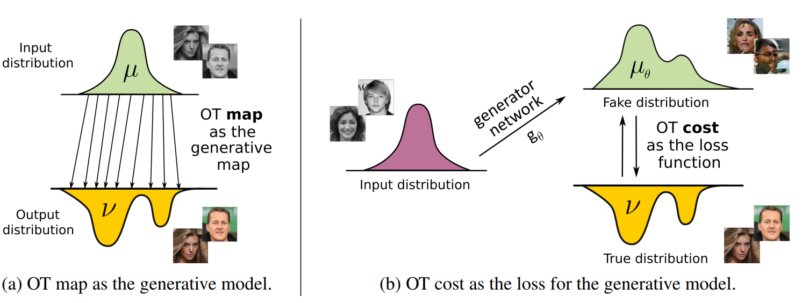
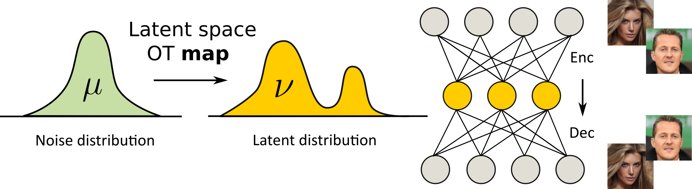
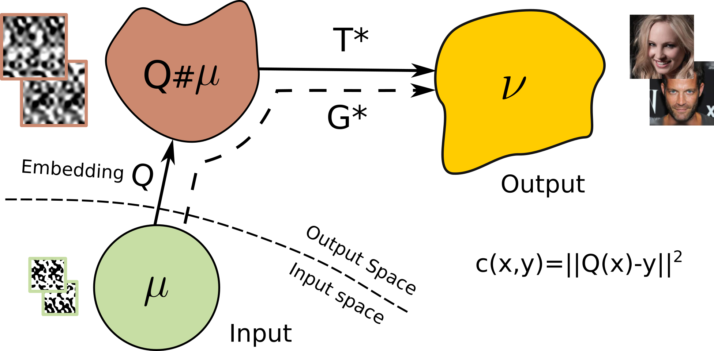
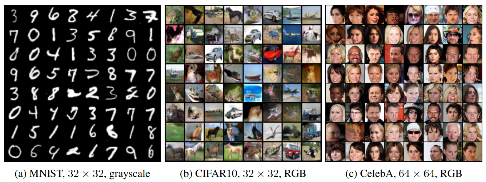
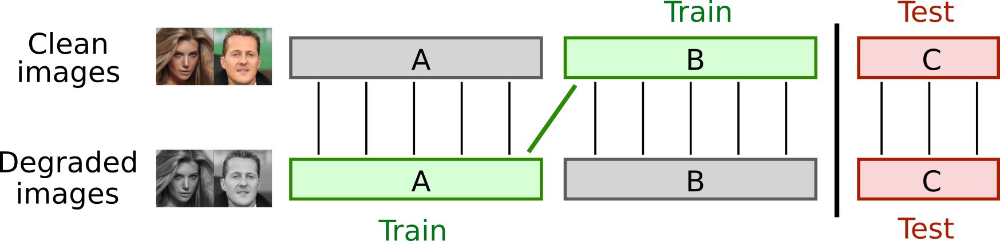
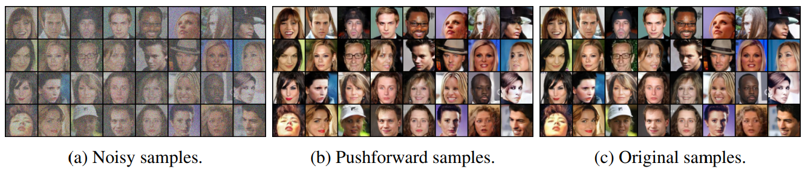
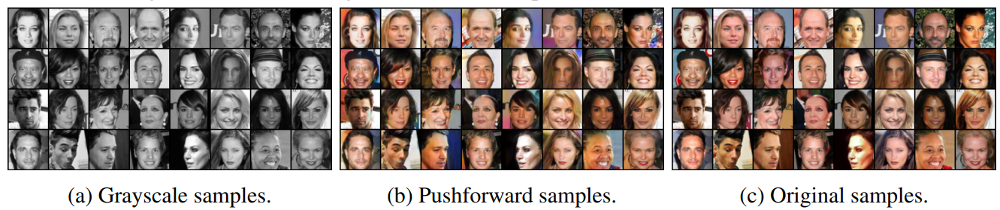
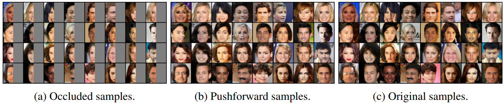
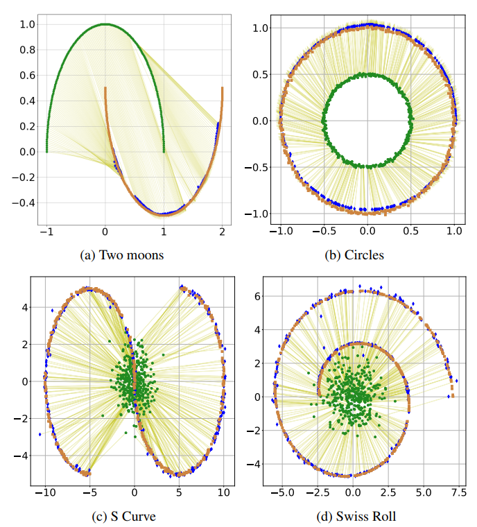

# Generative Modeling with Optimal Transport Maps

The repository contains reproducible `PyTorch` source code of our paper [Generative Modeling with Optimal Transport Maps](https://openreview.net/pdf?id=5JdLZg346Lw), ICLR 2022. It focuses on **Optimal Transport Modeling (OTM)** in ambient space, e.g. spaces of high-dimensional images. While analogous approaches consider OT maps in the latent space of an autoencoder, this paper focuses on fitting an OT map directly between noise and ambient space. The method is evaluated on generative modeling and unpaired image restoration tasks. In particular, large-scale computer vision problems, such as denoising, colorization, and inpaiting are considered in unpaired image restoration. The overall pipeline of OT as generative map and OT as cost of generative model is given below.

### Latent Space Optimal Transport
Our method is different from the prevalent approach of OT in the latent space shown below.

### Ambient Space Mass Transport
The scheme of our approach for learning OT maps between unequal dimensions.

## Prerequisites
The implementation is GPU-based. Single GPU (V100) is enough to run each experiment. Tested with 
`torch==1.4.0 torchvision==0.5.0.` To reproduce the reported results, consider using the exact version of `PyTorch` and its required dependencies as other versions might be incompatible.

## Repository structure
All the experiments are issued in the form of pretty self-explanatory `python` codes.

### Main Experiments
Execute the following commands in the `source` folder.

**Training**

- `python otm_mnist_32x22.py --train 1` -- OTM between noise and **MNIST**, 28x28, Grayscale;
- `python otm_cifar_32x32.py --train 1` -- OTM between noise and **CIFAR10**, 32x32, RGB;
- `python otm_celeba_64x64.py --train 1` -- OTM between noise and **CelebA**, 64x64, RGB;
- `python otm_celeba_denoise_64x64.py --train 1` -- OTM for unpaired denoising on **CelebA**, 64x64, RGB;
- `python otm_celeba_colorization_64x64.py --train 1` -- OTM for unpaired colorization on **CelebA**, 64x64, RGB;
- `python otm_celeba_inpaint_64x64.py --train 1` -- OTM unpaired inpainting on **CelebA**, 64x64, RGB.

Run inference with the best iteration.

**Inference**

- `python otm_mnist_32x32.py --inference 1 --init_iter 100000` 
- `python otm_cifar_32x32.py --inference 1 --init_iter 100000` 
- `python otm_celeba_64x64.py --inference 1 --init_iter 100000` 
- `python otm_celeba_denoise_64x64.py --inference 1 --init_iter 100000` 
- `python otm_celeba_colorization_64x64.py --inference 1 --init_iter 100000`
- `python otm_celeba_inpaint_64x64.py --inference 1 --init_iter 100000`

### Toy Experiments in 2D
- `source/toy/OTM-GO MoG.ipynb` -- Mixture of 8 Gaussians;
- `source/toy/OTM-GO Moons.ipynb` -- Two Moons;
- `source/toy/OTM-GO Concentric Circles.ipynb` -- Concentric Circles;
- `source/toy/OTM-GO S Curve.ipynb` -- S Curve;
- `source/toy/OTM-GO Swirl.ipynb` -- Swirl.

Refer to **Credit Section** for baselines.

## Results
### Optimal transport modeling between high-dimensional noise and ambient space.

**Randomly generated samples**

### Optimal transport modeling for unpaired image restoration tasks.
Following is the experimental setup that is considered for unpaired image restoration.

**OTM for image denoising on test C part of CelebA, 64 × 64.**

**OTM for image colorization on test C part of CelebA, 64 × 64.**

**OTM for image inpainting on test C part of CelebA, 64 × 64.**

### Optimal transport modeling for toy examples.

**OTM in low-dimensional space, 2D.**

## Credits
- [CelebA page](http://mmlab.ie.cuhk.edu.hk/projects/CelebA.html) with faces dataset and [this page](https://www.kaggle.com/jessicali9530/celeba-dataset) with its aligned 64x64 version;
- [Official FID repo](https://github.com/bioinf-jku/TTUR) to compute **FID** score;
- [Official IS repo](https://github.com/openai/improved-gan/tree/master/inception_score) to compute **Inception** score;
- [OT-ICNN](https://github.com/AmirTag/OT-ICNN) for **MoG** dataset and 2D baselines;
- [W2GN](https://github.com/iamalexkorotin/Wasserstein2GenerativeNetworks) for 2D baseline;
- [NCSN](https://github.com/ermongroup/ncsn) for ResidualBlock and INorm+ layer.

